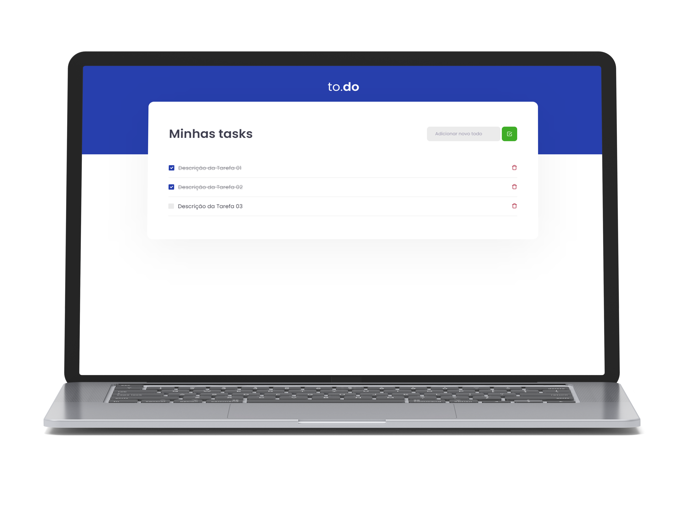

<h1 align="center">
  
</h1>

  <a href="#-tecnologias">Tecnologias</a>&nbsp;&nbsp;&nbsp;|&nbsp;&nbsp;&nbsp;
  <a href="#-projeto">Projeto</a>&nbsp;&nbsp;&nbsp;|&nbsp;&nbsp;&nbsp;
  <a href="#-como-executar">Como executar</a>&nbsp;&nbsp;&nbsp;|&nbsp;&nbsp;&nbsp;

  

## 🚀 Tecnologias
- [ReactJS](https://reactjs.org)
- [TypeScript](https://www.typescriptlang.org)

## 💻 Projeto
o to.do é um desafio que faz parte da trilha de ReactJS do Ignite da [Rocketseat](https://www.rocketseat.com.br) no qual o intuito é criar uma pequena aplicação de tarefas a fazer para fixar os conceitos de manipulação de estados do ReactJS.

## Como executar
- clone o repositório;
- utilize o comando `yarn` no terminal para instalar as dependências;
- inicie a aplicação com `yarn dev`;
- acesse no seu navegador por meio do http://localhost:8080/

---
Feito com 💜 como parte da trilha de React da Rocket.